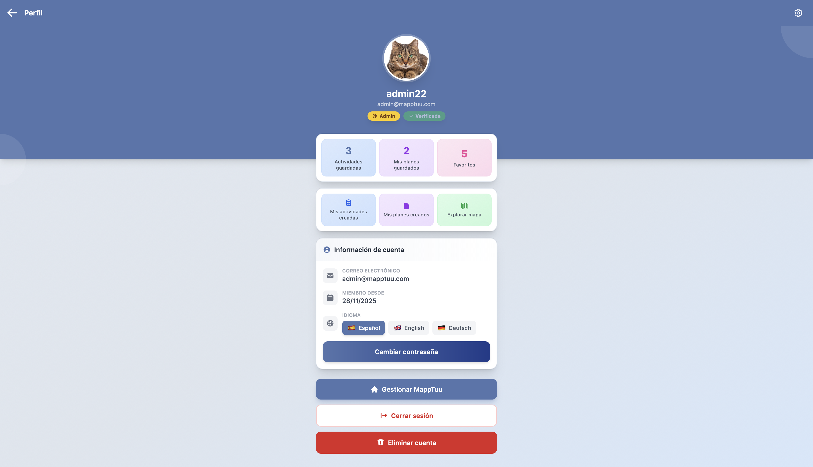
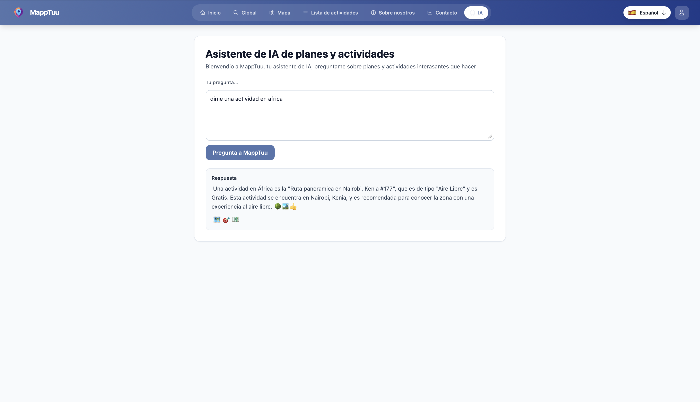
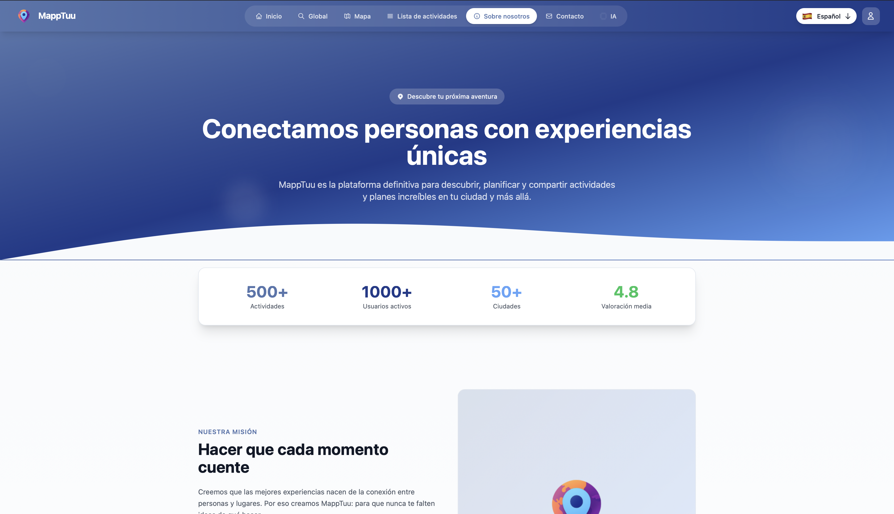
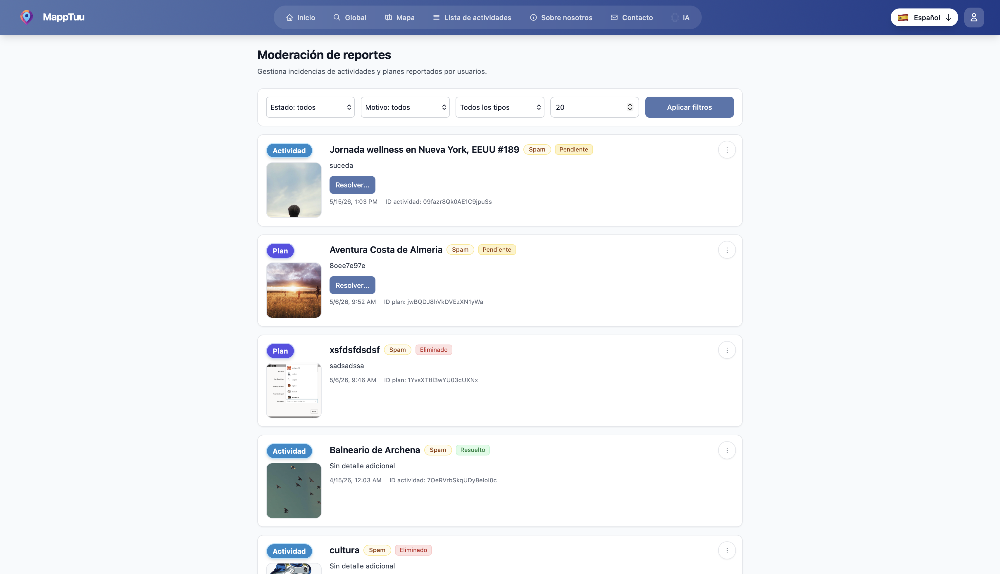

# MapTuu — Documentación del proyecto (2º DAM)

**Centro:** CPIFP Alan Turing (Málaga) · **Ciclo:** DAM · **Curso:** 2025/2026  
**Exposición:** 5 de junio de 2026 · **Orden en planning:** 7 (10:30–10:45)

**Repositorio guía del equipo** según [exposiciones_proyecto_intermodular_25_26_2DAM_M](https://github.com/CPIFPAlanTuring/exposiciones_proyecto_intermodular_25_26_2DAM_M).

---

## Índice de contenidos

1. [Personas del equipo](#1-personas-del-equipo)
2. [Explicación del proyecto](#2-explicación-del-proyecto)
3. [Capturas e imágenes del producto](#3-capturas-e-imágenes-del-producto)
4. [Qué aporta el proyecto en cada módulo](#4-qué-aporta-el-proyecto-en-cada-módulo)
5. [Enlaces a repositorios de código](#5-enlaces-a-repositorios-de-código)
6. [Enlace al artefacto en producción](#6-enlace-al-artefacto-en-producción)
7. [Documentación unificada del proyecto (PDF)](#7-documentación-unificada-del-proyecto-pdf)
8. [Resumen de la gestión en Jira (PDF)](#8-resumen-de-la-gestión-en-jira-pdf)
9. [Documentación de código (Compodoc)](#9-documentación-de-código-compodoc)
10. [Documentación técnica (Confluence) — complemento](#10-documentación-técnica-confluence--complemento)
11. [Pendientes y limitaciones conocidas](#11-pendientes-y-limitaciones-conocidas)

---

## 1. Personas del equipo

| Nombre | Correo educaAnd | Rol en el proyecto |
|--------|-----------------|-------------------|
| Ezequiel Vargas Berrocal | evarber0103@g.educaand.es | Frontend, integración Firebase, IA, documentación, Confluence |
| José Antonio Domínguez González | jdomgon334@g.educaand.es | Backend API, Android, despliegue, arquitectura |

Organización GitHub del código: [Jose-AntonioT8](https://github.com/Jose-AntonioT8).

---

## 2. Explicación del proyecto

**MapTuu** es una plataforma para **descubrir, crear y compartir actividades** y **planes** (itinerarios geolocalizados): turismo y ocio cotidiano en web, con **API REST**, **app Android** (visor) y **exportación de datos** para informes (Power BI).

### Problema que aborda

Centralizar en un solo lugar el descubrimiento de actividades, la planificación en itinerarios y la interacción de la comunidad (valoraciones, favoritos, reportes de contenido).

### Funcionalidades principales (producto)

| Área | Descripción |
|------|-------------|
| Explorar | Listados y **mapa** (Leaflet en web, Google Maps en Android) |
| Crear | Actividades y planes que agrupan varias actividades |
| Personalizar | Favoritos, perfil, edición de contenido propio |
| Valorar | Reseñas y puntuaciones |
| Buscar | Búsqueda global (usuarios registrados, web) |
| Asistente | Pantalla `/ia` en web (usuarios autenticados) |
| Moderación | Panel admin: tipos de actividad, cola de reportes |
| Móvil | App Android en modo **visor** del mismo catálogo vía API |
| Analítica | Script Python → CSV → Power BI (offline) |

Guía orientada a usuarios no técnicos en Confluence: [MapTuu — Guía de la aplicación](https://maptuu.atlassian.net/wiki/spaces/MAP/pages/24248485).

### Arquitectura (alto nivel)

Patrón de datos (web + API): **lecturas** en cliente con Firestore; **escrituras y reglas de dominio** vía HTTP a la API con token Firebase.

Diagrama ampliado en Confluence: [01 - Arquitectura general](https://maptuu.atlassian.net/wiki/spaces/MAP/pages/24150017).

---

## 3. Capturas e imágenes del producto

### Landing


### Perfil de usuario



### Listado de actividades


### Listado de planes


### Asistente IA



### Acerca de nosotros



### Mapa web


### Panel admin / reportes



### App Android — pantalla de inicio / login

*Pendiente:* subir `docs/img/09-android-login.png`.

### App Android — listado o mapa en móvil

*Pendiente:* subir `docs/img/10-android-mapa.png`.

### Dashboard Power BI

*Pendiente:* subir `docs/img/11-powerbi-dashboard.png`.

---

## 4. Qué aporta el proyecto en cada módulo

Estructura siguiendo la plantilla del repositorio del centro: objetivos del módulo cubiertos, evidencias y limitaciones.

### Acceso a datos — Juan Antonio García Gómez

**Objetivos cubiertos:** Firestore, autenticación Firebase y estructura del proyecto en Angular.

**Evidencias:**
- Modelo y colecciones en Firestore: [Confluence — Backend BBDD](https://maptuu.atlassian.net/wiki/spaces/MAP/pages/3112962)
- Lecturas con `onSnapshot`: servicios en `vercelAngularMappTuu` (`activity.service.ts`, `plan.service.ts`)
- Flujo de sesión Firebase Auth integrado entre frontend y backend
- Organización del frontend por capas (`features`, `common`, `core`) documentada en Confluence

**Limitaciones:** coexisten algunos campos legacy en datos históricos (`IdTypeActivity` vs `activityTypeId`).

---

### Programación multimedia y dispositivos móviles — David Hormigo Ramírez

**Objetivos cubiertos:** desarrollo de la APK Android y funcionalidades móviles.

**Evidencias:**
- Repositorio Android: https://github.com/Jose-AntonioT8/androidMappTuu
- APK de referencia: [MappTuu.apk](https://github.com/Jose-AntonioT8/androidMappTuu/blob/main/MappTuu.apk)
- Stack móvil: Kotlin, Jetpack Compose, Room, Retrofit, Hilt, Firebase Auth, Google Maps
- Pantallas de app: listado/detalle, mapa, perfil y autenticación

**Limitaciones:** el alcance móvil está centrado en modo visor; faltan las capturas `09-android-login.png` y `10-android-mapa.png` en el README.

---

### Programación de servicios y procesos — David Hormigo Ramírez

**Objetivos cubiertos:** se trabaja el mismo bloque funcional que en móvil, aplicado al ciclo completo de la app Android y sus integraciones.

**Evidencias:**
- Integración de cliente móvil con API REST mediante Bearer token
- Estructura por capas en Android (`ui`, `data`, `di`) y sincronización con backend
- Gestión de build y empaquetado APK para pruebas de proyecto
- Documentación técnica Android en Confluence: [09 - Android MappTuu](https://maptuu.atlassian.net/wiki/spaces/MAP/pages/27197450)

**Limitaciones:** no se plantea microservicio independiente para móvil; se reutiliza la API principal.

---

### Desarrollo de interfaces — Carmen Campos Fernández

**Objetivos cubiertos:** estilos, responsividad, contraste visual y apoyo a visualización analítica.

**Evidencias:**
- Frontend Angular + Tailwind: https://github.com/Jose-AntonioT8/vercelAngularMappTuu
- Ajustes de interfaz responsive en vistas principales (landing, login, sign-up, detalle)
- Uso de contraste de color y componentes visuales para mejorar legibilidad
- Integración de datos exportados para consumo en Power BI

**Limitaciones:** no hay auditoría formal WCAG versionada en el repo.

---

### Servidores y APIs — Juan Antonio García Gómez

**Objetivos cubiertos:** despliegue en Vercel, Swagger, seguridad y CORS.

**Evidencias:**
- API desplegada: https://vercel-node-mapp-tuu.vercel.app/api
- Swagger UI: https://vercel-node-mapp-tuu.vercel.app/api-docs/
- Configuración de cabeceras y CORS hacia frontend de producción
- Frontend desplegado en Vercel con pipeline de build y documentación

**Limitaciones:** algunos endpoints mantienen tareas de endurecimiento recogidas en riesgos técnicos.

---

### Empresa e iniciativa emprendedora II — Rosa Carmen Alcázar Rosal

**Objetivos cubiertos:** propuesta de valor, páginas informativas y enfoque de producto.

**Evidencias:**
- Definición de propuesta y público objetivo en Confluence: [MapTuu — Guía de la aplicación](https://maptuu.atlassian.net/wiki/spaces/MAP/pages/24248485)
- Páginas informativas `about` y `contact` en la web
- Narrativa de producto en landing y documentación de exposición

**Limitaciones:** faltan entregables de plan de negocio/finanzas en PDF dentro del repo.

---

### Sistemas de gestión empresarial — Miguel Ángel Ronda Carracao

**Objetivos cubiertos:** exportación CSV para análisis e integración con Power BI usando pandas con Python.

**Evidencias:**
- Repositorio de exportación: https://github.com/Jose-AntonioT8/PythonMappTuu
- Script `export_firestore_to_powerbi.py` con uso de pandas
- Generación de CSV relacionales para Power BI (`users`, `activities`, `plans`, `reviews`, enlaces)
- Documentación funcional en Confluence: [10 - Python MappTuu](https://maptuu.atlassian.net/wiki/spaces/MAP/pages/27426817)

**Limitaciones:** falta la captura del dashboard Power BI en `docs/img/11-powerbi-dashboard.png`.

---

## 5. Enlaces a repositorios de código

| Repositorio | Enlace | Visibilidad | Notas |
|-------------|--------|-------------|-------|
| **Frontend Angular** | https://github.com/Jose-AntonioT8/vercelAngularMappTuu | Privado | Rama producción: `frontend` |
| **Backend Node** | https://github.com/Jose-AntonioT8/vercelNodeMappTuu | Privado | Rama: `main` |
| **Android** | https://github.com/Jose-AntonioT8/androidMappTuu | **Público** | Incluye `MappTuu.apk` en raíz |
| **Python / Power BI** | https://github.com/Jose-AntonioT8/PythonMappTuu | Privado | `export_firestore_to_powerbi.py` |

Este repositorio (**Proyecto-Intermodular-MappTuu**) es solo documentación de exposición; el código vive en los cuatro repos anteriores.

---

## 6. Enlace al artefacto en producción

| Artefacto | URL | Notas |
|-----------|-----|-------|
| **Web (producción)** | https://vercel-angular-mapp-tuu.vercel.app/ | SPA Angular en Vercel |
| **API REST** | https://vercel-node-mapp-tuu.vercel.app/api | Base path `/api` |
| **Swagger / OpenAPI** | https://vercel-node-mapp-tuu.vercel.app/api-docs/ | Documentación interactiva de la API |
| **APK Android** | [MappTuu.apk en GitHub](https://github.com/Jose-AntonioT8/androidMappTuu/blob/main/MappTuu.apk) | ~48 MB; build de referencia en repo (mayo 2026) |

### Acceso para evaluación

- La **web** y la **API** son públicas en las URLs anteriores.
- Para probar flujos con sesión (crear actividad, favoritos, `/ia`, admin), hay que **registrarse** en la aplicación o solicitar al equipo credenciales de prueba si las hubiera configuradas en el entorno — **no se documentan aquí usuarios/contraseñas** por seguridad.
- Repos **privados**: el tribunal puede solicitar acceso invitado a la organización `Jose-AntonioT8` si necesita revisar código en GitHub.

### Comandos rápidos (desarrollo)

Ver [06 - Comandos y entornos](https://maptuu.atlassian.net/wiki/spaces/MAP/pages/23724045) en Confluence.

```bash
# Frontend
git clone https://github.com/Jose-AntonioT8/vercelAngularMappTuu.git
cd vercelAngularMappTuu && git checkout frontend
npm install && cp .env.example .env && npm start

# Backend
git clone https://github.com/Jose-AntonioT8/vercelNodeMappTuu.git
cd vercelNodeMappTuu && npm install && npm run dev

# Android (público)
git clone https://github.com/Jose-AntonioT8/androidMappTuu.git

# Python
git clone https://github.com/Jose-AntonioT8/PythonMappTuu.git
pip install -r requirements.txt && python export_firestore_to_powerbi.py
```

---

## 7. Documentación unificada del proyecto (PDF)

| Entregable | Estado | Enlace / notas |
|------------|--------|----------------|
| **PDF unificado (Confluence)** | Completado | [docs/pdf/confluence-maptuu.pdf](docs/pdf/confluence-maptuu.pdf) |

---

## 8. Resumen de la gestión en Jira (PDF)

| Entregable | Estado | Enlace / notas |
|------------|--------|----------------|
| **Resumen Jira (PDF)** | Pendiente | Exportar estadísticas del tablero en [maptuu.atlassian.net](https://maptuu.atlassian.net) y subir `docs/pdf/jira-resumen.pdf` |

---

## 9. Documentación de código (Compodoc)

| | |
|---|---|
| **Generación** | En `vercelAngularMappTuu`: `npm run docs` / `npm run docs:build` |
| **Publicación en producción** | https://vercel-angular-mapp-tuu.vercel.app/documentation/ |
| **Configuración Vercel** | `vercel.json` ejecuta `docs:build` en el build; salida en `dist/map-tuu/browser/documentation` |

Compodoc documenta componentes, servicios, guards y pipes del frontend Angular a partir de JSDoc en el código.

**Nota:** la API Node no usa Compodoc; su referencia es **Swagger** en la URL de producción indicada arriba.

---

## 10. Documentación técnica (Confluence) — complemento

Espacio del proyecto: **https://maptuu.atlassian.net/wiki/spaces/MAP**

| Documento | Enlace |
|-----------|--------|
| Home / índice | [MappTuu (overview)](https://maptuu.atlassian.net/wiki/spaces/MAP/overview) |
| Guía para personas | [MapTuu — Guía de la aplicación](https://maptuu.atlassian.net/wiki/spaces/MAP/pages/24248485) |
| Repositorios GitHub | [08 - Repositorios GitHub](https://maptuu.atlassian.net/wiki/spaces/MAP/pages/27000833) |
| Arquitectura | [01 - Arquitectura general](https://maptuu.atlassian.net/wiki/spaces/MAP/pages/24150017) |
| Frontend inicio | [Frontend MapPTuu - Inicio](https://maptuu.atlassian.net/wiki/spaces/MAP/pages/2981889) |
| Backend inicio | [Backend MapPTuu - Inicio](https://maptuu.atlassian.net/wiki/spaces/MAP/pages/3014658) |
| Rutas y guards | [Frontend - 2. Rutas y Guards](https://maptuu.atlassian.net/wiki/spaces/MAP/pages/2916353) |
| Modelo Firestore | [Backend - 3. BBDD](https://maptuu.atlassian.net/wiki/spaces/MAP/pages/3112962) |
| API REST | [Backend - 2. API](https://maptuu.atlassian.net/wiki/spaces/MAP/pages/3080193) |
| Android | [09 - Android MappTuu](https://maptuu.atlassian.net/wiki/spaces/MAP/pages/27197450) |
| Python / Power BI | [10 - Python MappTuu](https://maptuu.atlassian.net/wiki/spaces/MAP/pages/27426817) |
| Riesgos técnicos | [07 - Riesgos técnicos](https://maptuu.atlassian.net/wiki/spaces/MAP/pages/24117249) |

Índice ampliado en este repo: [docs/confluence-indice.md](docs/confluence-indice.md).

---

## 11. Pendientes y limitaciones conocidas

Lista detallada: **[docs/PENDIENTES.md](docs/PENDIENTES.md)**

Resumen:

- [x] PDF exportado de Confluence en `docs/pdf/confluence-maptuu.pdf`
- [ ] PDF resumen Jira en `docs/pdf/jira-resumen.pdf`
- [ ] Capturas Android: `docs/img/09-android-login.png`, `docs/img/10-android-mapa.png`
- [ ] Captura Power BI: `docs/img/11-powerbi-dashboard.png`
- [ ] URL de este repo en la [tabla del centro](https://github.com/CPIFPAlanTuring/exposiciones_proyecto_intermodular_25_26_2DAM_M#tabla-de-proyectos-participantes-y-url-del-repositorio) (sustituir `PENDIENTE` en orden 7)

---

## Referencia rápida — exposición

| Dato | Valor |
|------|-------|
| Fecha | 5 junio 2026, 9:00–13:00 |
| Franja equipo MapTuu | **10:30 – 10:45** (orden 7) |
| Duración máxima | 15 minutos (demo incluida) |
| Repo centro (tabla) | https://github.com/Ezequielvb/Proyecto-Intermodular-MappTuu |

---

*Documentación generada a partir de Confluence (espacio MAP), repos Jose-AntonioT8 y plantilla CPIFP Alan Turing. Última revisión: mayo 2026.*